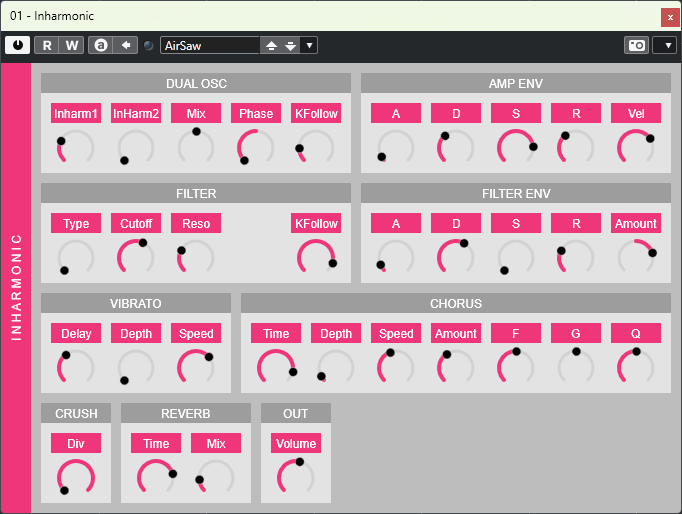

# Inharmonic

*A shiny synthesizer like a piano.*

<https://www.youtube.com/watch?v=a1Dy48y92fs>

The *Inharmonic* simulates the overtone characteristics of acoustic pianos. It's possible to synthesize more natural (physics-oriented) inharmonic sounds that FM synthesis could not.

- 2 Additive Synthesis Oscillators (polyphonic)
- 1 State Variable Filter (LPF12, HPF12, BPF12, LPF24, HPF24, BPF24)
- 1 Chorus
- 1 Bitcrusher
- 1 Reverb

## Downloads

The VST3 is available at the [Release](https://github.com/Mg32/inharmonic-vst3/releases) page.

## Installation (Windows)

1. Copy `Inharmonic.vst3` folder to `C:\Program Files\Common Files\VST3`.
2. Copy `VST3 Presets\mogesystem\Inharmonic\*.vstpreset` to `C:\Users\<USERNAME>\Documents\VST3 Presets\mogesystem\Inharmonic\*.vstpreset`.

## License

GPLv3 (due to VST3SDK). The main codes (source/dsp/*.h) are MIT License.

## Notes (for Geeks)

The *Inharmonic* uses sinusoidal additive synthesis to generate overtones. According to [H. Fletcher (1964)](https://doi.org/10.1121/1.1918933), the $n$-th overtone frequencies $f_n ~(n=1, 2, \dots)$ can be modeled as

$$
f_n = n f_0 \sqrt{1 + Bn^2} \approx n f_0 (1 + B n^2 / 2)
$$

, where $B$ is inharmonicity.
